🎓 Kotlin Workshop: <br>
<!-- omit in toc -->
Application development with Kotlin 
==================


| **Github repository**|
|--|
|https://github.com/SwinAkathon/kotlin-workshop |
|  |

<!-- omit in toc -->
## Overview
⏲️ **Duration :** 3 hours

🎓 **Level**: Beginner to Intermediate

The purpose of this workshop is to teach how to develop Android apps in Kotlin that uses the **modern features** of the language. 

The original target audience of the workshop are students participating in [Akathon4AIoT](https://fb.me/e/3zDMO0U1l) at Swinburne Vietnam. More generally, however, the workshop would be suitable for anyone who:
- has a basic knowledge in Kotlin and 
- is familiar with how to use Android Studio to develop a Kotlin app. 

The workshop includes **two modules**:

| Module | Title | Features | Outcomes | 
|:-------:|:-----------:|:-----------:|:-----------:|
| 01 | Frontend Development with Jetpack Compose | Jetpack Compose essentials | Full navigation app | 
| 02 | Processing Large Datasets | Kotlin Flow, LiveData, Paging | Data Processing app |  

All materials are stored in this github repository, which consists of several branches. Each branch is a version-level of some basic apps that can be developed using the workshop. A subset of the branches are used in the workshop. Others are available for extra references.

This workshop was prepared using various Kotlin and Jetpack-Compose materials from the following sources:
- Google code labs: https://developer.android.com/codelabs/
- Jetpack Compose developer site: https://developer.android.com/jetpack/compose/.
  
You can find referenced links to the above sites attached to the key Kotlin components that are used in the workshop.

<!-- omit in toc -->
## 📋 Table of Contents
- [🎓 Module 01: Building a full navigation app](#-module-01-building-a-full-navigation-app)
  - [LAB1: Creating your first Jetpack Compose apps](#lab1-creating-your-first-jetpack-compose-apps)
  - [LAB2: Building a full-navigation app](#lab2-building-a-full-navigation-app)
- [🎓 Module 02: Processing Large Data Sets](#-module-02-processing-large-data-sets)
  - [LAB3: Processing large data set with Paging](#lab3-processing-large-data-set-with-paging)
  - [LAB4: Processing real-time data](#lab4-processing-real-time-data)
<p>

# 🎓 Module 01: Building a full navigation app


## LAB1: Creating your first Jetpack Compose apps

### ✅ Set up your Kotlin programming environment
We use the standard **`Android studio (AS)`** IDE to develop mobile apps in Kotlin. 

`1.1.1` Read the [overview](https://developer.android.com/studio/intro) to understand Android Studio

`1.1.2` Follow these [instructions to install](https://developer.android.com/studio/install) Android Studio on your machine

`1.1.3` Understand [Android Studio UI](https://developer.android.com/studio/intro/user-interface)

`1.1.4` Understand the [essential development tasks](https://developer.android.com/studio/workflow)

The AS version that this workshop uses is: `Hedgehog 2023.1.1`

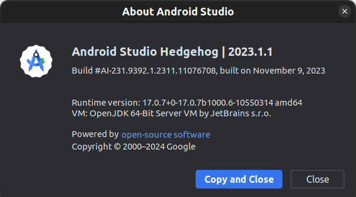

### ✅ Create a composable starter app

`1.2.1` In AS, create an `Empty Activity` project by following the menu: `File/New/New project` and then choose the `Empty Activity` type.

Name the project `helloworld` and keep the default settings as shown in the image below.

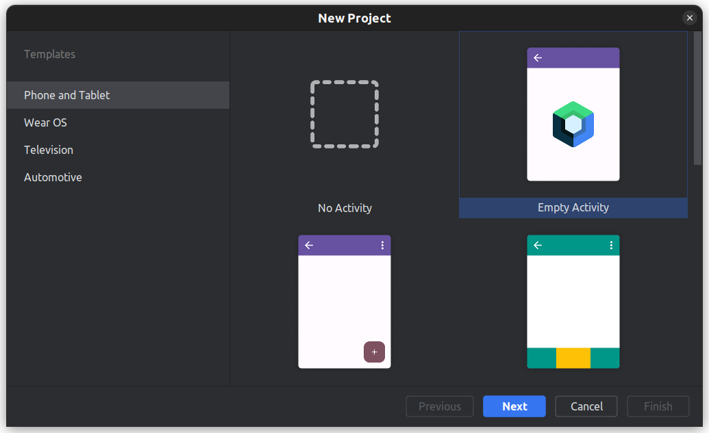

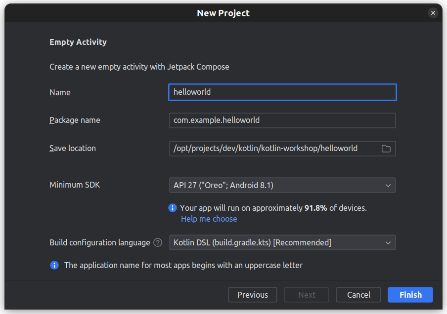

### ✅ Run the app on the emulator

Click the green `Run` toolbar button to run the app on the emulator. This deploys the app on the emulator, runs it to show the `Hello Android` message as displayed on the screen below:

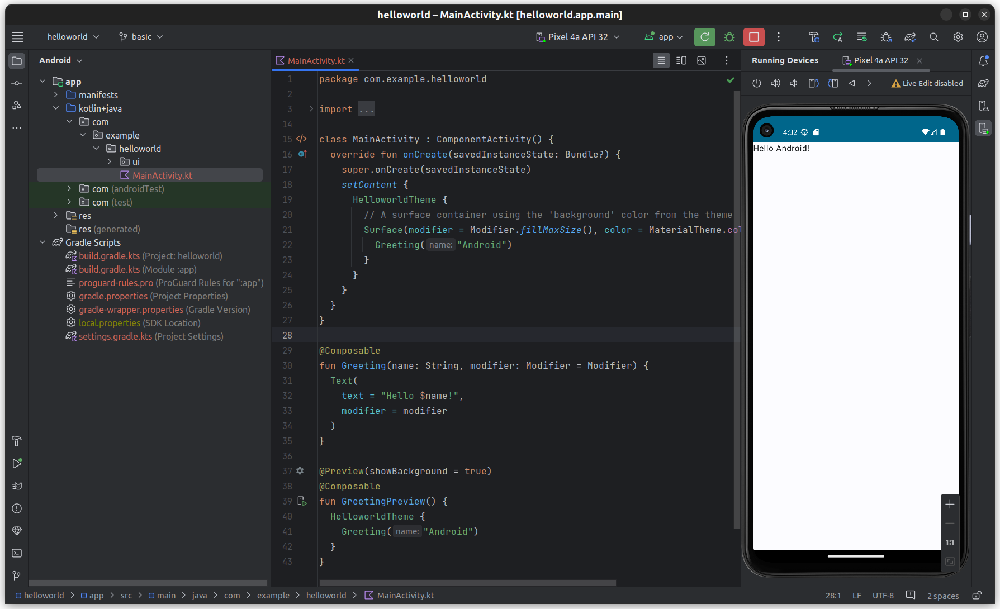


### ✅ Composable basics

- `Android panel` shows the project source code and build structure
  - The `source code` includes one Kotline file named `MainActivity.kt`
  - `Build structure` includes Gradle-specific configuration files.
- `Editor panel` shows the content of `MainActivity.kt`
- class `MainActivity` subclasses a built-in class named `ComponentActivity`
  - overrides `onCreate` to invoke `setContent()` with a `Composable` of typed `HelloworldTheme`
```
override fun onCreate(savedInstanceState: Bundle?) {
  super.onCreate(savedInstanceState)
  setContent {
    HelloworldTheme {
      // A surface container using the 'background' color from the theme
      Surface(modifier = Modifier.fillMaxSize(), color = MaterialTheme.colorScheme.background) {
        Greeting("Android")
      }
    }
  }
}
```
  - `HelloworldTheme` was automatically generated by the IDE project and is defined in the  `com.example.helloworld.ui.theme.Theme.kt`. It sets up the theme settings for the project (which are based on a built-in material design theme) and the **root composable** as the content.
- `Root composable` is a top-level component that is instantiated from the built-in `Surface`.
- `Surface`: a material design surface on which to layout UI components (other composables). It is used to set common settings (e.g. colors) for the contained components.
- `Greeting` is the app-level composable that displays app-specific content. It is defined as a function:
```
@Composable
fun Greeting(name: String, modifier: Modifier = Modifier) {
  Text(
    text = "Hello $name!",
    modifier = modifier
  )
}
```
- `Composable Preview`: another composable, named `GreetingPreview`, which is defined in `MainActivity.kt` file. It has the additional `@Preview` annotation attached to it and the content is set up to call the `Greeting` composable. The `Run...`  button on the side bar (next to the function header) allows developer to run the composable directly on the emulator. This is useful to enable quick UI preview of any composable of an app. 
  - **Note**: create one Composable Preview and reuse it to preview different composables in your app. Just list them in the content and comment out the one that you want to preview. 

### ✅ Tweak the UI

>💻 Follow [these instructions](https://developer.android.com/codelabs/jetpack-compose-basics#3) to complete the task.


### ✅ Reuse composables

>💻 Follow [these instructions](https://developer.android.com/codelabs/jetpack-compose-basics#4) to complete the task.

### ✅ Layout composables in a grid (row, column)
>💻 Follow [these instructions](https://developer.android.com/codelabs/jetpack-compose-basics#5) to complete the task.


### ✅ Maintain state (basic)
>💻 Follow [these instructions](https://developer.android.com/codelabs/jetpack-compose-basics#6) to complete the task.


### ✅ Maintain state with hoisting
>💻 Follow [these instructions](https://developer.android.com/codelabs/jetpack-compose-basics#7) to complete the task.


### ✅ Persist state
>💻 Follow [these instructions](https://developer.android.com/codelabs/jetpack-compose-basics#9) to complete the task.

### ✅ Animate item list
>💻 Follow [these instructions](https://developer.android.com/codelabs/jetpack-compose-basics#10) to complete the task.


### ✅ Style/Theme the app
>💻 Follow [these instructions](https://developer.android.com/codelabs/jetpack-compose-basics#11) to complete the task.


### ✅ Final touches
Use expandable icon to replace the button.

>💻 Follow [these instructions](https://developer.android.com/codelabs/jetpack-compose-basics#12) to complete the task.


### References
- [Jetpack Compose basics](https://developer.android.com/codelabs/jetpack-compose-basics#0) (with step-by-step guide and sample app)

> **Jetpack Compose** is a modern toolkit designed to simplify UI development. It combines a `reactive programming model` with the conciseness and ease of use of the Kotlin programming language. It is `fully declarative`, meaning you describe your UI by calling a series of functions that transform data into a `UI hierarchy`. When the underlying data changes, the framework `automatically re-executes` these functions, updating the UI hierarchy for you.
>
> A **Compose** app is made up of `composable functions` - just regular functions marked with `@Composable`, which can call other composable functions. A function is all you need to create a new UI component. The annotation tells `Compose` to add special support to the function for updating and maintaining your UI over time. `Compose` lets you structure your code into small chunks. Composable functions are often referred to as "`composables`" for short.
>
> By making `small reusable composables`, it's easy to build up a library of UI elements used in your app. Each one is responsible for one part of the screen and can be edited independently.


## LAB2: Building a full-navigation app

The app that we build in this lab is called `ecoms` as it has the structure of an ecommerce app. 

### ✅ Design the app structure
The aim is to design an app that has the essential navigation components, which include top, bottom and  drawer menu navigation. The content panel displays different a screen composable based on the user's selection on a navigation item or the user's interaction on a current screen.

Ecoms app structure (view on Google drive): https://drive.google.com/file/d/1LEv3gfwQcp_lJKYjuUDClwKyIYHj9bGR

Ecoms source code structure:
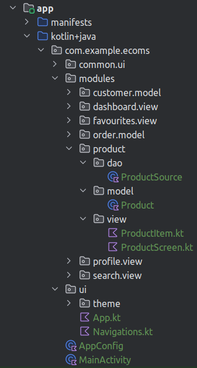

### ✅ Create the `App` and `AppConfig` classes

`App` composable represents the root application UI component. It provides a scaffold that holds together the navigation components and the application component screens.

The top-level composables that are referenced by `App` include `ModalNavigationDrawer`, `TopNav`, `BottomNav` and `Navigation`. All four top-level components are defined in the `Navigations.kt`. 
[`ModalNavigationDrawer`](https://developer.android.com/jetpack/compose/components/drawer) 'wraps' a `DrawerMenu` component over the other three components.
In particular, `Navigation` defines a navigation graph, every node of which is an application component screen (composable).

**`App.kt`**
-  `navController`: a shared `NavigationController` object that controls the navigation among composables
-  `drawState`: captures the drawer menu state, which includes access to `open` and `close` functions (invoked when user clicks on the menu) and other properties
- `ModalNavigationDrawer`: modal-typed drawer menu, which appears on top of other components. It takes a DrawerMenu composable, which creates a `ModalDrawerSheet` containing the menu items, and a [`Scaffold`](https://developer.android.com/jetpack/compose/components/scaffold) that nicely brings together the other three other top-level composables: `TopNav`, `Navigation` (content screens) and `BottomNav`.

```
package com.example.ecoms.ui

import androidx.compose.material3.DrawerValue
import androidx.compose.material3.ModalNavigationDrawer
import androidx.compose.material3.Scaffold
import androidx.compose.material3.rememberDrawerState
import androidx.compose.runtime.Composable
import androidx.navigation.compose.rememberNavController

@Composable
fun App() {
  // controls the navigation among composables
  val navController = rememberNavController()

  // drawer menu state (initialised to 'Closed') and is to be updated between Closed and Opened when user clicks on it
  val drawerState = rememberDrawerState(initialValue = DrawerValue.Closed)

  // a modal-typed drawer menu, which appears on top of other components
  ModalNavigationDrawer(
    drawerState = drawerState,
    drawerContent = { DrawerMenu(navController, drawerState) },
  ) {
    Scaffold(
      topBar = { TopNav(navController, drawerState) },
      content = { Navigation(navController, it) },
      bottomBar = { BottomNav(navController) }
    )
  }
}
```

**`AppConfig.kt`**
```
package com.example.ecoms

import androidx.compose.ui.graphics.Color
import androidx.compose.ui.text.TextStyle
import androidx.compose.ui.unit.dp
import androidx.compose.ui.unit.sp

class AppConfig {
  companion object {
    const val appName : String = "Ecoms"
    val styleHeading = TextStyle(fontSize = 35.sp)
    val styleNormal = TextStyle(fontSize = 14.sp)
    val styleTitle = TextStyle(fontSize = 35.sp)
    val styleDrawerMenuTitle = TextStyle(fontSize = 25.sp)
    val styleBtnText = TextStyle(fontSize = 25.sp)

    // colors used by Theme.kt
    // COMPOSABLES MUST NOT DIRECTLY USE COLORS HERE!
    val Navy = Color(0xFF073042)
    val Blue = Color(0xFF4285F4)
    val LightBlue = Color(0xFFD7EF12)
    val Chartreuse = Color(0xFFEFF7CF)

    val paddingContent = 16.dp
  }
}
```

**`MainActivity.kt`**
```
package com.example.ecoms

import android.os.Bundle
import androidx.activity.ComponentActivity
import androidx.activity.compose.setContent
import androidx.compose.foundation.layout.fillMaxSize
import androidx.compose.material3.MaterialTheme
import androidx.compose.material3.Surface
import androidx.compose.ui.Modifier
import com.example.ecoms.ui.App
import com.example.ecoms.ui.theme.EcomsTheme

class MainActivity : ComponentActivity() {
  override fun onCreate(savedInstanceState: Bundle?) {
    super.onCreate(savedInstanceState)
    setContent {
      EcomsTheme {
        // A surface container using the 'background' color from the theme
        Surface(modifier = Modifier.fillMaxSize(),
          color = MaterialTheme.colorScheme.background) {
          App()
        }
      }
    }
  }
}


```
### ✅ Create the `Navigation` composables

`Navigations.kt` contains definitions of the four top-level composables referenced by the `App` composable.

[`Navigation`](https://developer.android.com/jetpack/compose/navigation) defines a [`NavHost`](https://developer.android.com/guide/navigation/design#compose), which is a navigation graph consisting in a set of target composables that can be navigated to. Each navigation is performed through a route. The current code defines 5 screen composables: `Home`, `Products`, `Search`, `Favourites`, `Profile`.

#### `Navigation` graph
```
package com.example.ecoms.ui

import androidx.compose.foundation.layout.PaddingValues
import androidx.compose.foundation.layout.padding
import androidx.compose.foundation.layout.size
import androidx.compose.material.BottomNavigation
import androidx.compose.material.BottomNavigationItem
import androidx.compose.material.TopAppBar
import androidx.compose.material.icons.Icons
import androidx.compose.material.icons.filled.Favorite
import androidx.compose.material.icons.filled.Home
import androidx.compose.material.icons.filled.Menu
import androidx.compose.material.icons.filled.Person
import androidx.compose.material.icons.filled.Search
import androidx.compose.material3.Divider
import androidx.compose.material3.DrawerState
import androidx.compose.material3.Icon
import androidx.compose.material3.IconButton
import androidx.compose.material3.MaterialTheme
import androidx.compose.material3.ModalDrawerSheet
import androidx.compose.material3.NavigationDrawerItem
import androidx.compose.material3.NavigationDrawerItemDefaults
import androidx.compose.material3.Text
import androidx.compose.runtime.Composable
import androidx.compose.runtime.rememberCoroutineScope
import androidx.compose.ui.Modifier
import androidx.compose.ui.graphics.Color
import androidx.compose.ui.graphics.RectangleShape
import androidx.compose.ui.graphics.vector.ImageVector
import androidx.compose.ui.unit.dp
import androidx.navigation.NavController
import androidx.navigation.NavHostController
import androidx.navigation.compose.NavHost
import androidx.navigation.compose.composable
import com.example.ecoms.AppConfig
import com.example.ecoms.modules.dashboard.view.DashBoard
import com.example.ecoms.modules.favourites.view.FavouritesScreen
import com.example.ecoms.modules.product.view.ProductScreen
import com.example.ecoms.modules.profile.view.ProfileScreen
import com.example.ecoms.modules.search.view.SearchScreen
import kotlinx.coroutines.CoroutineScope
import kotlinx.coroutines.launch

@Composable
fun Navigation(navController: NavHostController, paddingValues: PaddingValues) {
  NavHost(
    navController = navController,
    startDestination = "Home",
    modifier = Modifier.padding(paddingValues)
  ) {
    composable("Home") {
      DashBoard(navController)
    }
    composable("Products") {
      ProductScreen(navController)
    }
    composable("Search") {
      SearchScreen(navController)
    }
    composable("Favourites") {
      FavouritesScreen(navController)
    }
    composable("Profile") {
      ProfileScreen(navController)
    }
  }
}
```

```
/**
 * @effects: toggle the drawer menu whose state drawState between Opened and Closed
 */
fun toggleDrawerMenu(drawerState: DrawerState, coroutineScope: CoroutineScope) {
  coroutineScope.launch {
    drawerState.apply {
      if (isClosed) open() else close()
    }
  }
}
```

#### `TopNav`: Top navigation
A [top navigation bar](https://developer.android.com/jetpack/compose/components/app-bars) contains an application name label and an `IconButton` that provides access to the collapsable drawer menu.

```
@Composable
fun TopNav(navController: NavHostController, drawerState: DrawerState) {
  val coroutineScope = rememberCoroutineScope()

  TopAppBar(
    title = {
      Text(text = AppConfig.appName,
        style = AppConfig.styleTitle
                   )
    },
    backgroundColor = MaterialTheme.colorScheme.primaryContainer,
    navigationIcon = {
      IconButton(onClick = { toggleDrawerMenu(drawerState, coroutineScope) }) {
        Icon(
          imageVector = Icons.Filled.Menu,
          contentDescription = "Menu",
          modifier = Modifier.size(100.dp)
        )
      }
    }
  )
}
```

#### `DrawerMenu`: drawer menu

[`Drawer menu`](https://developer.android.com/jetpack/compose/components/drawer) provides a slide-in top-level menu that provides access to key components of an app.

In this example, we set up the drawer menu with items representing the top-level screens (set up in the navigation graph) and using the navigation controller to navigate to them upon user selection.
Of course, we do not forget, upon navigation, to use function `toggleDrawerMenu()` to close the menu.

```
@Composable
fun DrawerMenu(navController: NavController, drawerState: DrawerState) {
  val coroutineScope = rememberCoroutineScope()

  val itemColors = NavigationDrawerItemDefaults.colors(
    unselectedContainerColor = MaterialTheme.colorScheme.primaryContainer, // Background color when not selected
    selectedContainerColor = MaterialTheme.colorScheme.primaryContainer, // Background color when selected
  )

  val items = arrayOf("Products", "Search", "Favourites", "Profile")

  ModalDrawerSheet(drawerContainerColor = MaterialTheme.colorScheme.primaryContainer) {
    Text(AppConfig.appName, modifier = Modifier.padding(16.dp),
      style = AppConfig.styleDrawerMenuTitle)
    Divider()
    items.forEach { item ->
      NavigationDrawerItem(
        label = { Text(text = item) },
        selected = false,
        colors = itemColors,
        onClick = {
          navController.navigate(item)
          toggleDrawerMenu(drawerState, coroutineScope)
        }
      )
    }
  }
}
```

#### `BottomNav`
The [bottom navigation](https://developer.android.com/jetpack/compose/navigation#bottom-nav) provides quick access to between 3 to 5 top-level components of the app. 

```
@Composable
fun BottomNav(navController: NavController) {
  val items = mapOf<String, ImageVector>(
    "Home" to Icons.Default.Home,
    "Search" to Icons.Default.Search,
    "Favourites" to Icons.Default.Favorite,
    "Profile" to Icons.Default.Person
    )

  BottomNavigation(backgroundColor = MaterialTheme.colorScheme.primaryContainer) {
    items.forEach { (item, image) ->
      BottomNavigationItem(
        selected = navController.currentDestination?.route == item,
        onClick = { navController.navigate(item) },
        icon = { Icon(image, contentDescription = item,
          modifier = Modifier.size(40.dp)) },
      )
    }
  }
}
```

### ✅ Create `modules` whose `screens` are composables

#### Overview
Typically, a module consists of three basic subpackages: 
- `model`: the domain classes of the module (e.g. `Product`)
- `view`: consists of one or more composables that represent the different view screens through which the user is able to interact with and update the `model` state
- `dao`: consists of data-access objects, responsible for loading and storing domain objects to the underlying data source. 

#### Module: Product
| Types | Components | Description |
|-------|------------|-------------|
| model | `Product` | a data class describing products in terms of `id`, `name` |
| view  | Composables: `ProductScreen`, `ProductItemsScreen`, `ProductItem` | hierarchy of composables that define the view components for the products | 
| dao  | `ProductSource` | represents a data source that stores data about the product objects

`Product`
```
package com.example.ecoms.modules.product.model

data class Product(val id: Int, val name: String)
```
`ProductScreen`
```
package com.example.ecoms.modules.product.view

import android.content.Context
import androidx.compose.foundation.border
import androidx.compose.foundation.layout.Box
import androidx.compose.foundation.layout.Column
import androidx.compose.foundation.layout.fillMaxHeight
import androidx.compose.foundation.layout.fillMaxWidth
import androidx.compose.foundation.layout.padding
import androidx.compose.foundation.layout.wrapContentHeight
import androidx.compose.material3.MaterialTheme
import androidx.compose.material3.Surface
import androidx.compose.material3.Text
import androidx.compose.runtime.Composable
import androidx.compose.ui.Alignment
import androidx.compose.ui.Modifier
import androidx.compose.ui.text.style.TextAlign
import androidx.compose.ui.unit.TextUnit
import androidx.compose.ui.unit.TextUnitType
import androidx.compose.ui.unit.dp
import androidx.navigation.NavController
import com.example.ecoms.ui.theme.EcomsTheme

private val LTAG = "ProductScreen"

@Composable
fun ProductScreen(navController: NavController) {
  val surfaceHeight = 1f
  val context: Context = navController.context

  EcomsTheme {
    Box(
      modifier = Modifier
        .fillMaxWidth()
        .fillMaxHeight()
        .border(width = 1.dp, color = MaterialTheme.colorScheme.onPrimary)
        .padding(10.dp), contentAlignment = Alignment.TopCenter
    ) {
      // A surface container using the 'background' color from the theme
      Surface(
        modifier = Modifier
          .fillMaxWidth(surfaceHeight)
          .wrapContentHeight()
//        ,color = MaterialTheme.colorScheme.primary
      ) {
        Column {
          // title
          Text("Products",
            textAlign = TextAlign.Center,
            modifier = Modifier.fillMaxWidth(),
            fontSize = TextUnit(32f, TextUnitType.Sp))
          // content
          ProductItemsScreen(context)
        }
      }
    }
  }
}
```

`ProductItemsScreen`
```
package com.example.ecoms.modules.product.view

import android.content.Context
import android.widget.Toast
import androidx.compose.foundation.layout.Row
import androidx.compose.foundation.layout.fillMaxHeight
import androidx.compose.foundation.layout.fillMaxWidth
import androidx.compose.foundation.layout.padding
import androidx.compose.foundation.lazy.LazyColumn
import androidx.compose.runtime.Composable
import androidx.compose.ui.Alignment
import androidx.compose.ui.Modifier
import androidx.compose.ui.unit.dp
import com.example.ecoms.modules.product.dao.ProductSource

@Composable
fun ProductItemsScreen(context: Context,
                       maxWidth: Float = 1f,
                       maxHeight: Float = 1f
) {
  val myItems = ProductSource.products

  Row(modifier = Modifier.padding(bottom = 5.dp)) {
    // use row to add padding to the next item on the same surface
    LazyColumn(
      modifier = Modifier
        .fillMaxWidth(maxWidth)
        .fillMaxHeight(maxHeight)
//        .border(width=1.dp,color= Color.Red)
      ,
      horizontalAlignment = Alignment.CenterHorizontally
    ) {
      items(myItems.size) { index ->
        val product = myItems[index]
        ProductItem(product = product, onCheckedChange = { isChecked ->
          // todo: Handle product selection
          notify(context, product.toString())
        })
      }
    }
  }
}

fun notify(context: Context, msg: String) {
  Toast.makeText(context, msg, Toast.LENGTH_SHORT).show()
}
```

`ProductItem`
```
package com.example.ecoms.modules.product.view

import androidx.compose.foundation.layout.Column
import androidx.compose.foundation.layout.Row
import androidx.compose.foundation.layout.fillMaxWidth
import androidx.compose.foundation.layout.padding
import androidx.compose.material3.Checkbox
import androidx.compose.material3.Text
import androidx.compose.runtime.Composable
import androidx.compose.runtime.getValue
import androidx.compose.runtime.mutableStateOf
import androidx.compose.runtime.remember
import androidx.compose.runtime.setValue
import androidx.compose.ui.Alignment
import androidx.compose.ui.Modifier
import androidx.compose.ui.text.font.FontWeight
import androidx.compose.ui.unit.dp
import com.example.ecoms.modules.product.model.Product

@Composable
fun ProductItem(product: Product, onCheckedChange: (Boolean) -> Unit) {
  var isChecked by remember { mutableStateOf(false) }

  Row(
    modifier = Modifier.fillMaxWidth().padding(8.dp),
    verticalAlignment = Alignment.CenterVertically
  ) {
    Column(
      modifier = Modifier.weight(1f).padding(start = 8.dp)
    ) {
      Text(text = "ID: ${product.id}", fontWeight = FontWeight.Bold)
      Text(text = "Name: ${product.name}")
    }
    Checkbox(
      checked = isChecked,
      onCheckedChange = {
        isChecked = it
        onCheckedChange(it)
      }
    )
  }
}
```

`ProductSource`
```
package com.example.ecoms.modules.product.dao

import com.example.ecoms.modules.product.model.Product

class ProductSource () {
    // customise this for each domain class type
  companion object {
    val products: List<Product> = readProducts()
      private fun readProducts(): List<Product> {
        return List(100) {
          val id = it+1
          Product(id, "Product ${id}")
        }
      }
  }
}
```

#### Solution code
Branch `basic` of this repository has the solution code for the components discussed so far. 

#### 💻 Exercise: other modules
Apply your understanding of the Product module to complete the code of the following modules:
- `Customer`
- `Order`
- `Dashboard`
- `Favourites`
- `Search`
- `Profile`

### ✅ (Optional) Create `calculator` module
Extends `ecoms` to include a `calculator` module. The screen design is as shown in the image below.

> `Calculator` screen:
> <details>
>  <summary>Click to view!</summary>
>  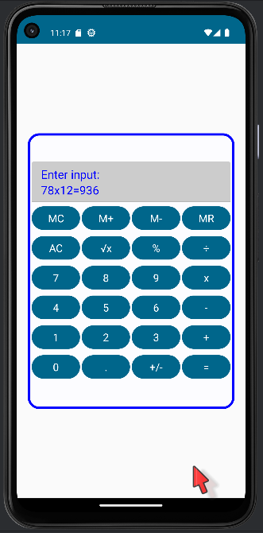
> </details>

# 🎓 Module 02: Processing Large Data Sets


## LAB3: Processing large data set with Paging

### ✅ Maintaining `state` with `View Model`

### ✅ Paging-aware design pattern

The aim is to incrementally read data from a (potentially large) data source, one page at a time.

#### Class diagram
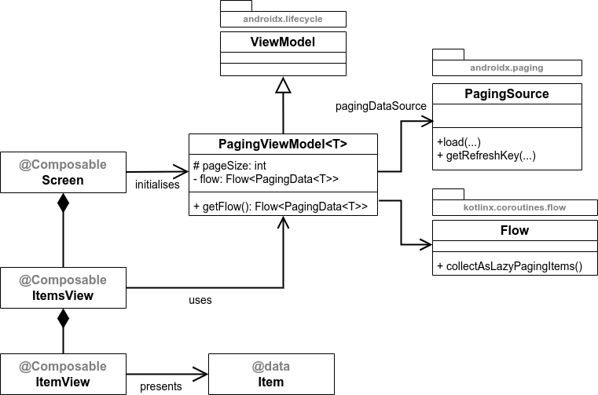

The design pattern relies on 3 built-in classes:
1. `ViewModel`: to maintain shared data between screens that is safe between configuration changes
2. `PagingSource`: to act as the data source adapter that supports data paging. We need to specialise `PagingSource` for each type of data source (including structured file, relational database, JSON, XML, etc.)
3. `Flow`: to stream the data from `PagingSource`, one page at a time and in an asynchronous manner. Asynchrony is supported by coroutine.

Together, these components enable `Screen`s  to read and display data incrementally, giving a smooth scrolling action of the data. The LHS of the class diagram depicts a typical screen structure of an app that uses the design pattern. In this, the data items are presented on an `ItemsView` composable (e.g. a list view, represented by `LazyColumn`). `ItemsView` is in turn composed of the `ItemView` composable, which is responsible for presenting the view of each individual data item. 

#### Communication diagram

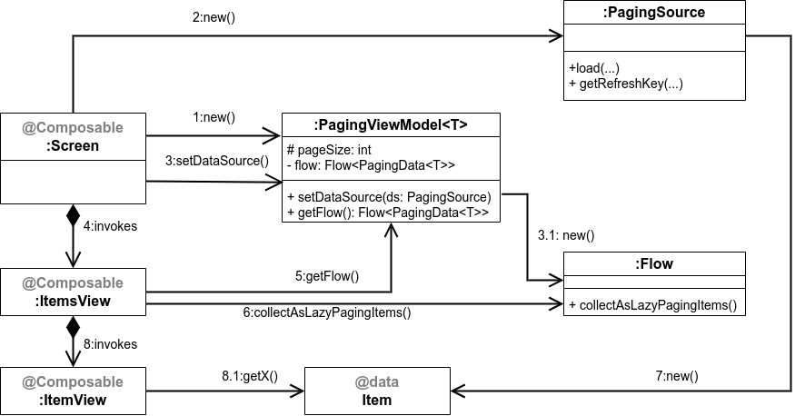

The above UML [communication diagram](https://www.uml-diagrams.org/communication-diagrams.html) depicts the logic flow of the design pattern. It shows a typical run-time execution scenario, in which objects of the classes collaborate with each other (through method invocations, a.k.a exchanging messages) in an orderly fashion. The numbers attached to each message arrow show the sequence of messages. 

#### Example: `Product` module
We briefly explain below the design and code of the module `Product` of the `ecoms` app, that implements the paging-aware design pattern. The full source code of this module and the app is provided in the [branch `advanced`](https://github.com/SwinAkathon/kotlin-workshop/tree/advanced/ecoms) of this repository.

Generic classes (reusable for different modules):
1. `common.vmodel.PagingViewModel`: implements the `PagingViewModel` in the design pattern
2. `common.dao.PagingFileSource`: implements the `PagingSource` for CSV data source
3. `common.dao.ObjectFileProc`: implements a generic string-to-object conversion function, which is used by `PagingFileSource` to create objects from each line read from the CSV file.

The `ProductScreen` module of the `ecoms` app consists of the following components:
1. `view.ProductScreen` composable: implements the `Screen` for products.
2. `view.ProductItemsScreen` composable: implements the `ItemsView` for products.
3. `view.ProductItem`: implements the `ItemView` for products.
4. `view.ProductViewModel`: derived from the generic `PagingViewModel` class for `Product`.
5. `model.Product`: implements the data class for products.
6. `dao.ProductPagingSource`: derived from a generic `PagingFileSource` class for `Product`.

> `Product` screen:
> <details>
>  <summary>Click to view</summary>
>  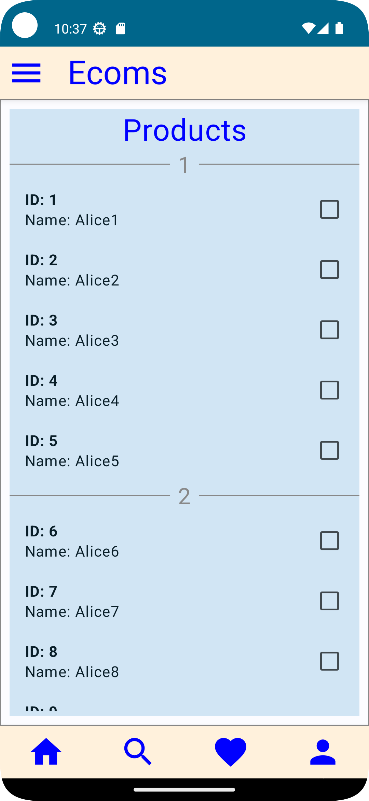
> </details>

#### Code walk-through
A brief walk-through of the key code segments, which include the followings:

1. `ProductScreen`: myViewModel initialisation with `ProductPagingSource` (a subtype of `PagingFileSource`)
2. `ProductItemsScreen`: 
   1. `pagingItems` (collected through `viewModel.getFlow().collectAsLazyPagingItems()`)
   2. page-based items view 
   3. visual loading progress indicator
3. `ProductViewModel` (a subtype of `PagingViewModel`): sets up the flow with the paging data source. 
4. `PagingFileSource`: a subtype of `DataSource` (which in turn is a subtype of `PagingSource`)
   1. function `load()`: page-based loading of items from file
   2. uses an input lambda (`objectFileProc`) to generically convert each line into an object

## LAB4: Processing real-time data 

Both real-time and static data sets are treated as data streams which need to be processed by an app. The main feature of real-time or dynamic data is that the data are streamed into the app while it is being run. This is sometimes referred to as [**push-based data model**](https://learning.oreilly.com/library/view/c-reactive-programming/9781788629775/12641805-43d3-4c88-875a-299eef5c2d85.xhtml), where the data sources are in control of providing (or pushing) the data. This is different from the conventional pull-based data model found in typical business applications, where the application controls what and when the data are pulled in for processing. 

Push-based data processing model is common among IoT applications, where the IoT nodes (including sensors and devices) become the data sources, pushing the data in real-time to the apps that are interested in processing them. The data are multicasted to the apps through channels, called **topics**. The apps subscribe to the topics of interest and receive the data when they become available.

In this lab, we will learn to develop a real-time data application, following the push-based model, that processes data that are received through a popular IoT-based messaging protocol, named [MQTT (Message Queuing Telemetry Transport)](https://mqtt.org/). 

### Real-time App Design model 
The following diagram extends and specialises the design pattern model presented earlier in LAB3 to construct a design model for a push-based real-time app. The net result is a **push- and page-based design model** that supports loading real-time data one page at a time. 

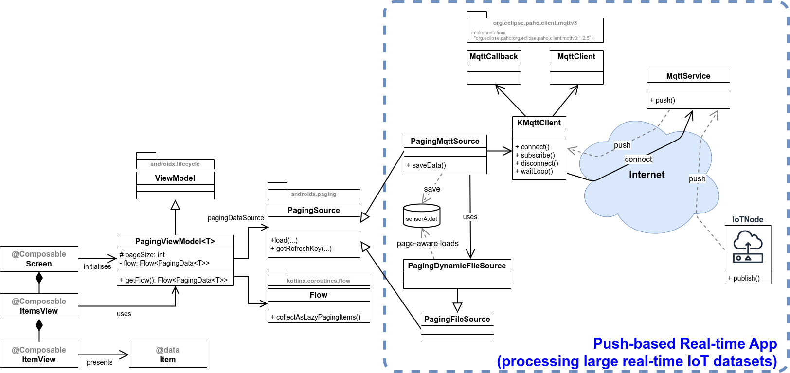

### Example: `Humidity` module
The following screenshots demonstrate the humidity module of the `ecoms`, which receives the real-time humidity data from the MQTT service and incrementally displays them on a `LazyColumn`.

> **Initial push- and page-based loading screen with `LazyColumn`**
> <details>
>  <summary>Click to view</summary>
>  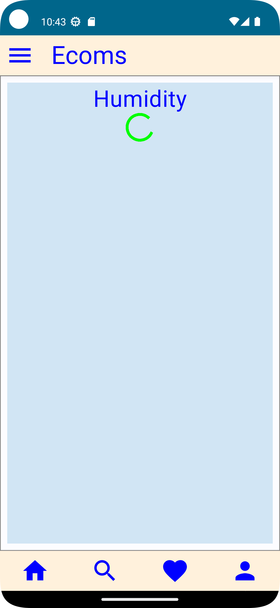
> </details>

> **Subsequent page-based loading screen**
> <details>
>  <summary>Click to view</summary>
>  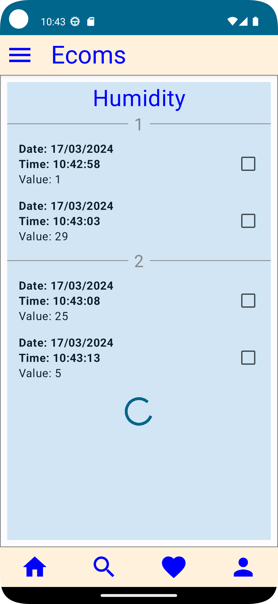
> </details>
> 

### (Optional) Message broker service for MQTT
In the lab, the MQTT service and a reference IoT node are already set up for you so you only need to connect the app to the service to receive data.

If you want to set up an MQTT service for your own application then follow the instructions given on this [Github repository](https://github.com/vandaipham/MQTT_TEST) to:
1. install an MQTT service on a docker container
2. runs a Python-based IoT node that periodically pushes temperature, humidity, and light data to subcribers (clients) on the MQTT network (via the MQTT service)

Thanks **Dr. Dai Van Pham** for the Github repository!

### Implementation
Refer to the `advanced` branch of this repository for the source code of `ecoms` app that implement the real-time app design model with the `Humidity` module. This module processes data received from the MQTT service through the channel named `ihome/feeds/humidity`.

In fact, the MQTT service pushes data to three channels, one for each type of sensor reading: 
1. humidity: `ihome/feeds/humidity`
2. temperature: `ihome/feeds/temperature`
3. light: `ihome/feeds/light`

The implementation is modular so that you can adapt it for your own module. 

#### Code walk-through
A brief walk-through of the key code segments, which include the followings:

1. `HumidityScreen`: similar to `ProductScreen` but uses `HumidityPagingSource` instead of `PagingFileSource`
2. `HumidityPagingSource`: a subtype of `PagingMqttSource` to read MQTT data from the humidity channels
3. `PagingMqttSource`: a generic base class for reading Mqtt data from a set of input feeds (channels). 
   1. uses `KMqttClient` to connect to MQTT service and save data of each channel to a local CSV file (named after the channel)
   2. uses `PagingDynamicFileSource` to page-based read data from the CSV file
4. `PagingDynamicFileSource`: a sub-type of `PagingFileSource` that continuously read data from a file one page at a time. It does not stop and continuously wait for new data in the file. 
5. `KMqttClient`: a wrapper class form `MqttClient` provided by the Paho library.

### 💻 Exercise: 
#### Other modules
1. Adapt the `Humidity` module to implement two modules for presenting the data received from the temperature and light channels. 
2. Apply the **master-detail design pattern** to create a detail view screen (composable) for each module. When the user clicks on an item, shows the detailed screen listing the item. Training resources:
   - [List detail layout](https://developer.android.com/jetpack/compose/layouts/list-detail)

#### Paging relational data source
Adapt the `PagingMqttSource` class to implement a `PagingMqttRelationalSource` that also reads streaming data from the MQTT service but uses a relational database to store the received data (instead of using a CSV file):
1. Create `PagingMqttRelationalSource` in the `...common.dao` package
2. Create a class named `PagingRelationalDataSource`, that is used by function `PagingMqttRelationalSource.saveData()` to store the received data of each channel to a database table (e.g. humidity data is stored in the `humidity` table). Create the table if it does not exist:
   1. uses the Jetpack's **Room API** to store the local data into SQLlite datatabase. Training materials:
      - [Save data in a local database](https://developer.android.com/training/data-storage/room)
      - [**Collabs** workshop on Room](https://developer.android.com/codelabs/basic-android-kotlin-compose-persisting-data-room)

   2. a better alternative is to use an external database (e.g. MySQL) to store the data. For testing, you can run this database on the same host machine running the app.


